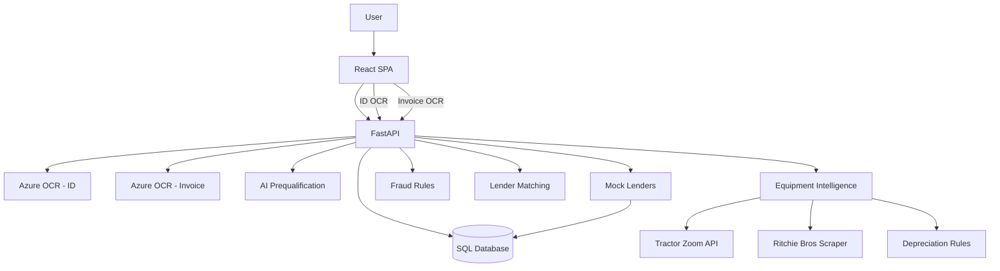

# Architecture

## High-level system architecture

- Frontend: React SPA in `loan-intake-frontend/` (Create React App) with a multi-step loan intake wizard and dealer portal views.
- Backend: FastAPI app in `loan-intake-backend/` composed in `main.py` and backed by SQLAlchemy models in `database.py`.
- OCR: Azure Computer Vision OCR for ID and invoice parsing.
- AI: Prequalification engine in `ai_prequalification/` and equipment intelligence in `equipment_intelligence/`.
- Storage: SQL database via SQLAlchemy (loan applications, lenders, preferences, matches, users).

## Backend modules and services

- Core:
  - `core/settings.py`: environment-based settings (backend/frontend URLs, CORS, DB, auth).
  - `core/dependencies.py`: auth and DB dependencies.
- Routers:
  - `routers/ocr_routes.py`: ID, invoice/asset, barcode OCR.
  - `routers/lookup_routes.py`: serial decode, NAICS search, manufacturers list.
  - `routers/address_routes.py`: address validation and autocomplete.
  - `routers/dealer_routes.py`: dealer search/details/nearby (Google Places).
  - `routers/azure_auth_routes.py`, `routers/debug_auth_routes.py`, `routers/callback_spa.py`.
  - `routers/loan_routes.py`: application lifecycle, dashboard, offers, prequal proxy, one-click submit.
  - `routers/lender_routes.py`: lenders, preferences, matching.
  - `routers/admin_routes.py`: vendors, locations, salespeople.
  - `routers/health.py`: health endpoints.
- Services (selected):
  - `services/ocr_service.py`: Azure OCR read + barcode detection.
  - `services/invoice_ocr_service.py`: invoice OCR field extraction.
  - `services/ocr_parser.py`: ID field parsing (name/DOB/address).
  - `services/invoice_parser.py`: OCR text parsing helpers.
  - `services/ai_prequal_service.py`: prequalification proxy client.
  - `services/equipment_intelligence_orchestrator.py`: comparables, depreciation, fraud flags aggregation.
  - `services/fraud_detection.py`: fraud rule evaluation.
  - `services/tractor_zoom_service.py`: Tractor Zoom API client.
  - `services/ritchie_bros_scraper.py`: Ritchie Bros scraper.
  - `services/loans/*`: drafts, validation, submit, offers, matching, stats, dashboard.
  - `services/mock_lenders.py`: lender simulation used for offers.
- AI prequalification:
  - `ai_prequalification/`: engine, schemas, data generation, model training, routes.
- Equipment intelligence:
  - `equipment_intelligence/`: modules, rules engine, orchestrator, API schemas/routes.

## Frontend components

- Wizard flow: `LoanApplicationWizard`, `BorrowerInfoStep`, `CoBorrowerInfoStep`,
  `DealerInfoStep`, `LoanRequestStep`, `DocumentsAndConsentsStep`, `ConfirmationStep`.
- Equipment inputs: `AssetForm`, `TradeInSection`, `LoanCalculator`.
- Dealer portal: `Dashboard`, `LoanOffersView`, `LenderDashboard`.
- Lender configuration: `LenderPreferences`.
- API client: `src/services/api.js` (centralized fetch wrapper).

## API routes (by prefix)

<!-- AUTO-GENERATED: API_ROUTES_START -->
- `/ocr`
  - `POST /ocr/asset`
  - `POST /ocr/barcode`
  - `POST /ocr/id`
- `/lookup`
  - `GET /lookup/manufacturers`
  - `GET /lookup/naics`
  - `GET /lookup/serial/{serial_number}`
- `/address`
  - `GET /address/autocomplete`
  - `GET /address/lookup-zip`
  - `POST /address/validate`
- `/dealers`
  - `GET /dealers/details/{place_id}`
  - `GET /dealers/nearby`
  - `GET /dealers/search`
- `/auth`
  - `GET /auth/callback`
  - `GET /auth/callback-spa`
  - `GET /auth/login`
  - `GET /auth/profile`
  - `POST /auth/callback`
  - `POST /auth/verify`
- `/loans`
  - `DELETE /loans/{application_id}`
  - `GET /loans/dashboard`
  - `GET /loans/location-applications`
  - `GET /loans/my-applications`
  - `GET /loans/stats/location-stats`
  - `GET /loans/stats/my-stats`
  - `GET /loans/stats/vendor-stats`
  - `GET /loans/vendor-applications`
  - `GET /loans/{application_id}`
  - `PATCH /loans/{application_id}/save-draft`
  - `POST /loans/one-click-submit`
  - `POST /loans/prequalify`
  - `POST /loans/start`
  - `POST /loans/submit`
  - `POST /loans/{application_id}/accept-offer`
  - `POST /loans/{application_id}/get-offers`
  - `POST /loans/{application_id}/reopen`
  - `PUT /loans/{application_id}/save-draft`
- `/lenders`
  - `GET /lenders/matches/{application_id}`
  - `GET /lenders/{lender_id}/preferences`
  - `POST /lenders/match/{application_id}`
  - `POST /lenders/{lender_id}/preferences`
- `/equipment`
  - `POST /equipment/intelligence`
- `/admin`
  - `GET /admin/locations`
  - `GET /admin/salespeople`
  - `GET /admin/vendors`
  - `PATCH /admin/salespeople/{salesperson_id}/deactivate`
  - `POST /admin/locations`
  - `POST /admin/salespeople`
  - `POST /admin/vendors`
- `/health`
  - `GET /health/auth-hints`
  - `GET /health/healthz`
- `/`
  - `GET /`
  - `GET /healthz`
  - `GET /lenders`
  - `POST /lenders`
  - `POST /prequalify`
- `/debug`
  - `GET /debug/auth-config`
  - `GET /debug/auth-health`
  - `GET /debug/test-auth-flow`
  - `POST /debug/test-token`
<!-- AUTO-GENERATED: API_ROUTES_END -->

## OCR pipeline

- ID OCR:
  - `POST /ocr/id` -> `services/ocr_service.extract_text_from_id`
  - `services/ocr_parser.find_name/find_dob/find_address` extract structured fields.
- Invoice/asset OCR:
  - `POST /ocr/asset` -> `services/ocr_service.extract_text_from_image`
  - `services/invoice_parser.extract_invoice_details` for basic invoice fields.
- One-click invoice OCR:
  - `services/invoice_ocr_service.extract_invoice_data` uses Azure Read API to extract
    dealer/buyer/equipment/financial fields for automation flows.

## AI prequalification

- Core route: `POST /prequalify` in `ai_prequalification/routes.py`.
- Proxy route: `POST /loans/prequalify` -> `services/ai_prequal_service.run_prequalification`.
- Frontend: `LoanRequestStep` calls `/prequalify` via `prequalificationAPI`.

## Equipment intelligence

- Core route: `POST /equipment/intelligence` -> `equipment_intelligence/orchestrator/intelligence_orchestrator.py`.
- Modules: `valuation_module`, `predictive_resale_module`, `serial_number_module`,
  `equipment_history_module`, `rules_engine/*`.
- One-click orchestration: `services/equipment_intelligence_orchestrator.py` aggregates
  Tractor Zoom comparables, Ritchie Bros data, depreciation rules, and fraud flags.

## Fraud detection

- `services/fraud_detection.evaluate_fraud_flags` applies duplicate serial, hour, price,
  and invoice tampering checks.
- Additional risk flags are produced inside `equipment_intelligence/rules_engine/risk_rules.py`.

## Lender matching

- `services/loans/matching.py`:
  - `match_application_to_lenders` persists matching results.
  - `rank_lenders_with_scores` scores lenders by LTV, equipment type, NAICS, dealer state, risk tier.
- API: `/lenders/match/{application_id}` and `/lenders/matches/{application_id}`.

## Dealer portal

- Dashboard: `Dashboard` -> `GET /loans/dashboard`.
- Offers: `LoanOffersView` -> `POST /loans/{application_id}/get-offers`.
- Lender dashboard: `LenderDashboard` consumes dashboard payloads.
- One-click submit: `LoanRequestStep` -> `POST /loans/one-click-submit`.

## Data flow diagram (Mermaid)

