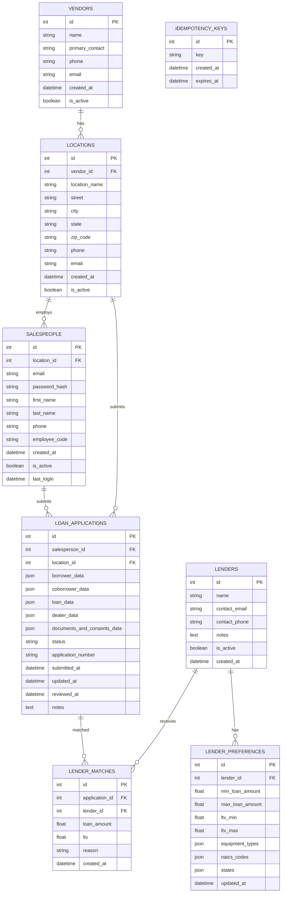

# Data Model ERD

This document describes the persisted SQLAlchemy tables and the JSON payloads stored inside loan applications.

## Database entities

<!-- AUTO-GENERATED: ERD_START -->

<!-- AUTO-GENERATED: ERD_END -->

## Loan application JSON payloads

`loan_applications` stores several JSON blobs:

- borrower_data, coborrower_data: BorrowerIntakePayload (models/loan_application.py)
  - firstName, lastName, dateOfBirth, ssn, email, phone
  - employerName, annualIncome, status
  - farmType, acresOwned, acresLeased, farmWebsite, farmsocialmediaaccount, yearsInOperation
  - farmIncomeLast3Years: [{year, income, notFiled}]
  - naicsCode, farmLegalEntity
  - softCreditPullConsent, existingFarmDebt, personalDebt, insuranceStatus
  - bankruptcyHistory, priorLoanDefaults, priorRepossess, priorRepossession, taxLienHistory
- loan_data: dict (not typed in backend schema)
- dealer_data: dict (not typed in backend schema)
- documents_and_consents_data: dict (not typed in backend schema)

BorrowerInfo (schemas/borrower.py) also defines a borrower address used in API payloads:

- address: {street, city, state, zip}

## Non-persistent API schemas

- LenderOffer and OffersResponse define response payloads for lender decisions.
- AzureTokenResponse defines the auth response payload.
