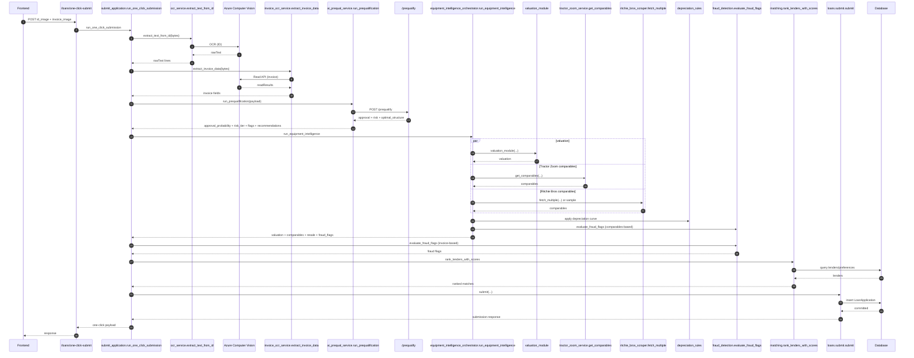

# One-Click Submission Sequence

This document reflects the actual execution flow in `services/submit_application.py`
and the supporting services it calls.

## Execution order (code-accurate)

1. `POST /loans/one-click-submit` enters `routers/loan_routes.py`.
2. `one_click_context` injects DB + salesperson into `submit_application.run_one_click_submission`.
3. ID OCR:
   - `services/ocr_service.extract_text_from_id` sends the image to Azure Computer Vision OCR.
   - `services/ocr_parser.find_name`, `find_dob`, `find_address`, plus `_extract_ssn` parse fields.
4. Invoice OCR:
   - `services/invoice_ocr_service.extract_invoice_data` calls Azure Read API and normalizes invoice fields.
5. Auto-fill payloads are constructed for borrower, equipment, loan, dealer.
6. AI prequalification:
   - `services/ai_prequal_service.run_prequalification` calls `POST /prequalify` and normalizes the response.
7. Equipment intelligence:
   - `services/equipment_intelligence_orchestrator.run_equipment_intelligence` runs valuation,
     Tractor Zoom comparables, Ritchie Bros comparables, depreciation curves, and an internal fraud check.
8. Fraud detection:
   - `services/fraud_detection.evaluate_fraud_flags` runs invoice-based rules.
9. Lender matching:
   - `services/loans/matching.rank_lenders_with_scores` scores active lenders using LTV, type, NAICS,
     dealer state, and risk tier.
10. Final submission:
    - `services/loans/submit.submit` persists the application.
11. Response returns borrower, equipment, trade-in, AI prequal, intelligence, fraud flags,
    lender matches, and submission payload.

## Sequence diagram (Mermaid)

